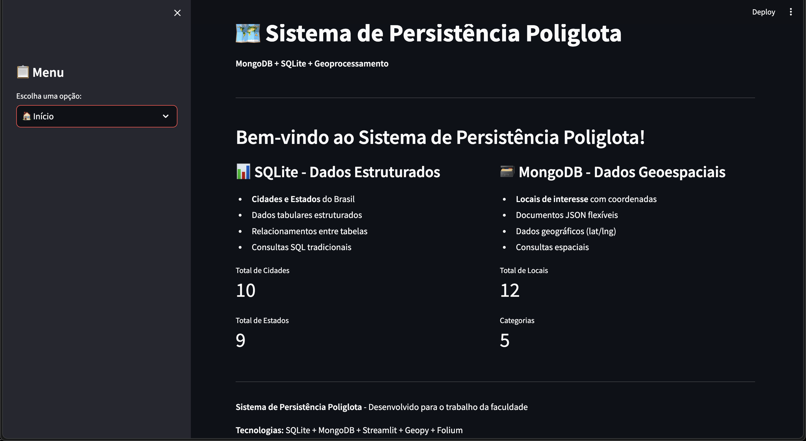

# Sistema de Persistência Poliglota

## Descrição
Sistema desenvolvido para demonstrar o uso de persistência poliglota, combinando SQLite e MongoDB para armazenar e consultar dados em diferentes contextos, com funcionalidades de geoprocessamento e visualização interativa.

## Tecnologias Utilizadas
- **Python 3.10+**
- **Streamlit** - Interface web interativa
- **SQLite3** - Banco de dados relacional para dados estruturados
- **MongoDB** - Banco de dados NoSQL para dados geoespaciais
- **PyMongo** - Driver para MongoDB
- **Geopy** - Cálculo de distâncias geográficas
- **Folium** - Visualização de mapas
- **Pandas** - Manipulação de dados

## Funcionalidades

### 1. Gerenciamento de Cidades (SQLite)
- Cadastro de cidades e estados
- Dados estruturados com relacionamentos
- Consultas SQL tradicionais
- Dados de exemplo do Nordeste brasileiro

### 2. Gerenciamento de Locais (MongoDB)
- Cadastro de locais com coordenadas geográficas
- Documentos JSON flexíveis
- Categorização de locais
- Metadados e descrições

### 3. Geoprocessamento
- Cálculo de distâncias entre pontos
- Busca por proximidade geográfica
- Validação de coordenadas
- Estatísticas geográficas

### 4. Consultas Integradas
- Cruzamento de dados SQLite e MongoDB
- Visualização de locais por cidade
- Relacionamento entre dados estruturados e não estruturados

### 5. Visualização
- Mapas interativos com Folium
- Marcadores com informações detalhadas
- Estatísticas visuais

## Instalação

### Opção 1: Docker (Recomendado)

#### Pré-requisitos
- Docker
- Docker Compose

#### Passos para instalação

1. **Clone o repositório:**
```bash
git clone <url-do-repositorio>
cd trabalho-banco-poliglota
```

2. **Execute o script de inicialização:**
```bash
./run.sh
```

3. **Acesse no navegador:**
```
http://localhost:8501
```

#### Comandos Docker úteis:
```bash
# Ver logs em tempo real
docker-compose logs -f

# Parar os containers
docker-compose down

# Reiniciar os containers
docker-compose restart

# Reconstruir e iniciar
docker-compose up --build
```

### Opção 2: Instalação Local

#### Pré-requisitos
- Python 3.10 ou superior
- MongoDB instalado e rodando localmente

#### Passos para instalação

1. **Clone o repositório:**
```bash
git clone <url-do-repositorio>
cd trabalho-banco-poliglota
```

2. **Instale as dependências:**
```bash
pip install -r requirements.txt
```

3. **Inicie o MongoDB:**
```bash
# No macOS com Homebrew:
brew services start mongodb-community

# No Linux:
sudo systemctl start mongod

# No Windows:
# Inicie o serviço MongoDB através do Services Manager
```

4. **Execute a aplicação:**
```bash
streamlit run app.py
```

5. **Acesse no navegador:**
```
http://localhost:8501
```

## Estrutura do Projeto

```
projeto_persistencia_poliglota/
│
├── app.py                    # Aplicação principal Streamlit
├── db_sqlite.py             # Conexão e funções do SQLite
├── db_mongo.py              # Conexão e funções do MongoDB
├── geoprocessamento.py      # Funções de cálculo geográfico
├── requirements.txt         # Dependências do projeto
├── README.md               # Este arquivo
└── cidades.db              # Banco SQLite (criado automaticamente)
```

## Como Usar

### 1. Primeira Execução
1. Execute a aplicação com `streamlit run app.py`
2. Acesse a página "Gerenciar Cidades (SQLite)"
3. Clique em "Popular Banco SQLite" para adicionar dados de exemplo
4. Acesse a página "Gerenciar Locais (MongoDB)"
5. Clique em "Popular Banco MongoDB" para adicionar locais de exemplo

### 2. Navegação
- **Início**: Visão geral do sistema e estatísticas
- **Gerenciar Cidades**: CRUD de cidades e estados no SQLite
- **Gerenciar Locais**: CRUD de locais geoespaciais no MongoDB
- **Consultas Integradas**: Cruzamento de dados dos dois bancos
- **Geoprocessamento**: Cálculos de distância e busca por proximidade
- **Visualização no Mapa**: Mapa interativo com todos os locais
- **Estatísticas**: Gráficos e métricas do sistema

### 3. Exemplos de Uso

#### Buscar locais próximos:
1. Vá para "Geoprocessamento"
2. Digite coordenadas de um ponto central
3. Defina o raio de busca em km
4. Clique em "Buscar Locais Próximos"

#### Visualizar locais de uma cidade:
1. Vá para "Consultas Integradas"
2. Selecione uma cidade da lista
3. Veja os locais relacionados no MongoDB

#### Calcular distância entre pontos:
1. Vá para "Geoprocessamento"
2. Digite as coordenadas dos dois pontos
3. Clique em "Calcular Distância"

## Dados de Exemplo

O sistema inclui dados de exemplo do Nordeste brasileiro:

### SQLite (Cidades):
- Estados: PB, PE, CE, RN, AL, SE, BA, MA, PI
- Cidades principais com população e área

### MongoDB (Locais):
- Pontos turísticos
- Praças e centros culturais
- Mercados tradicionais
- Praias e locais de interesse

## Arquitetura

### Persistência Poliglota
- **SQLite**: Dados estruturados, relacionais (cidades, estados)
- **MongoDB**: Dados semi-estruturados, geoespaciais (locais com coordenadas)

### Integração
- Consultas cruzadas entre os bancos
- Relacionamento por nome da cidade
- Visualização unificada na interface

### Geoprocessamento
- Cálculo de distâncias (Geopy + Haversine)
- Busca por proximidade
- Validação de coordenadas
- Estatísticas geográficas

## Desenvolvido por
Rian Lucas Gomes Candido - 30632722

**Professor:** Ricardo Roberto de Lima

## Capturas de tela


# persistencia-poliglota
